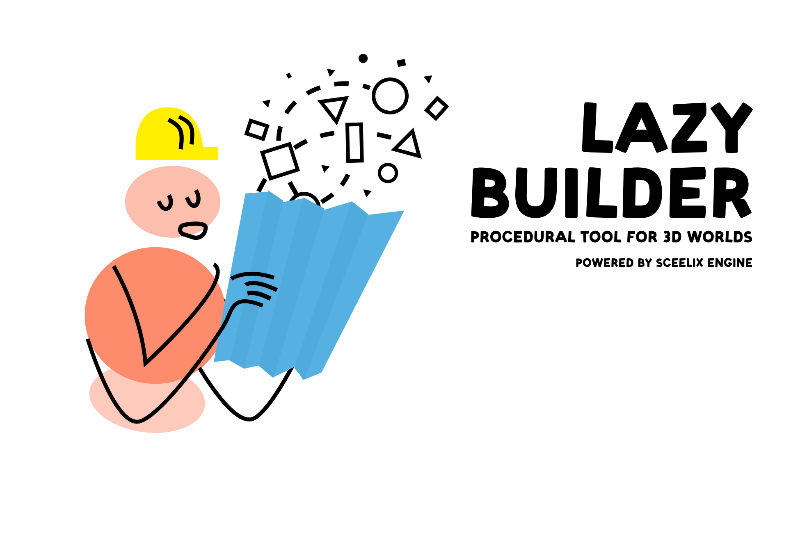
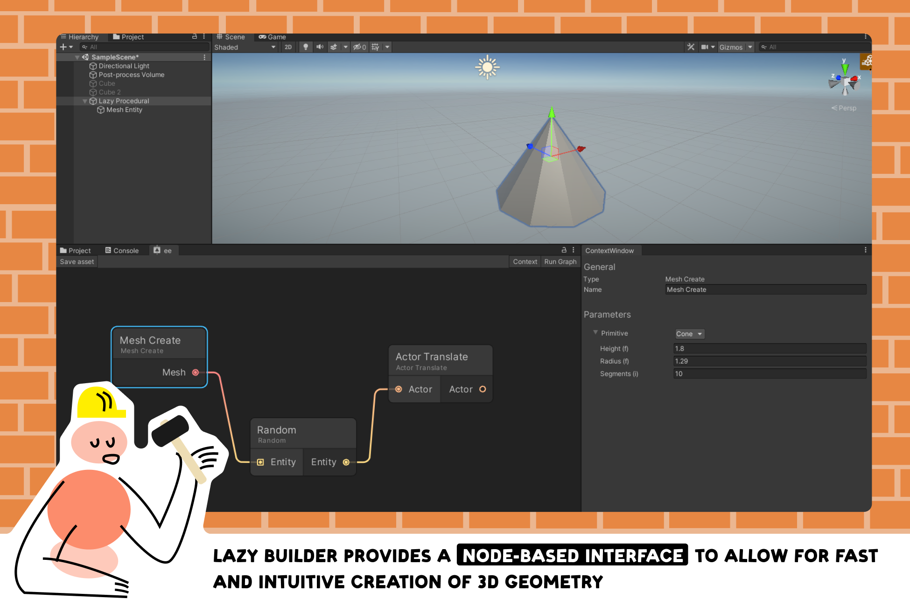

## Build your desired levels at an instant of a click! 🛠️
Lazy Builder is a procedural tool (powered by [Sceelix](https://github.com/sceelix/Sceelix) ) designed to simplify the construction of complex 3D environments. 

 

## Super Lightweight 🏋️
Its whole source occupies less than 5Mb. 

 

## Make use of the Node based interface 🧊

 
 

## Super fast 🖋️
The tool was designed to give the quickest response time when generating a graph

 

## Installation ⤵️

For now you can download & import manually the ***.unitypackage** in the [Releases Section](https://github.com/wafflesgama/LazyBuilder/releases) 

 

## Quickstart 🛫

**Before importing Lazy Builder:**
- Make sure that you are using Unity 2020.3 or above 
- Make sure that the ***Api Compatibility*** is set to ***Net 4.x*** or ***Net Framework*** (in Edit> Project Settings> Player Api Compatibility Level) 

Follow [this tutorial](https://docs.google.com/presentation/d/1rUGbXzxXKXIvSs6e_vvyMhGzZoylVPB5) for some simple exercises to get you started.

 

## Contribute ☕
If you found out this tool useful and/or want to help this project continue its development you can [buy me a coffee](https://www.buymeacoffee.com/guilhermeGama)!

    

## Support 🧑‍💻  
If you spotted a bug, need a feature or have an awesome suggestion you can always [create a GitHub issue](https://github.com/wafflesgama/LazyBuilder/issues), fork it & merge request or simply contact me directly via e-mail. 
If you want to be a part of this project and contribute to it feel free to do so!

 

## Licensing 📜
The Lazy ecosystem is licensed under MIT License [(consult it here)](./LICENSE)  
Crediting is not required but is kindly appreciated 🤗
